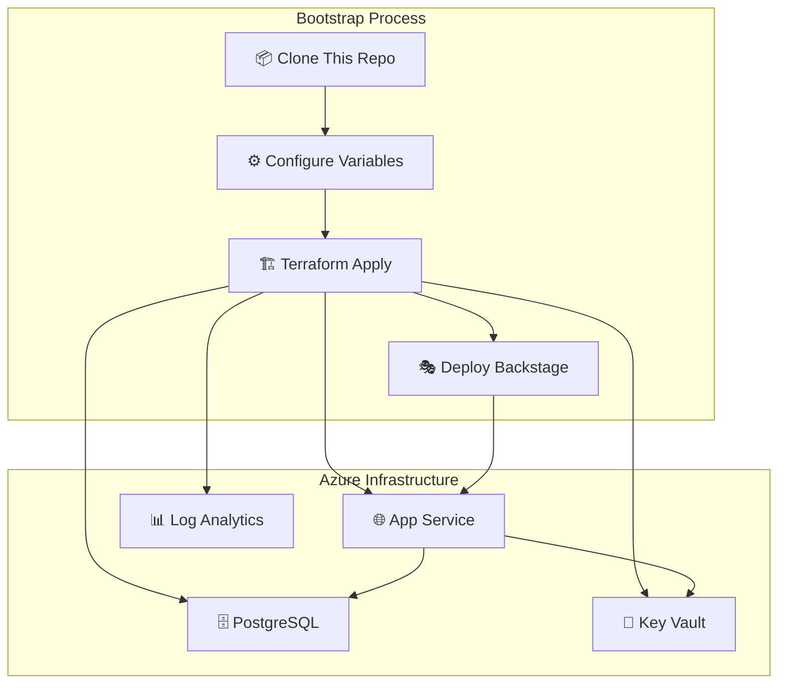
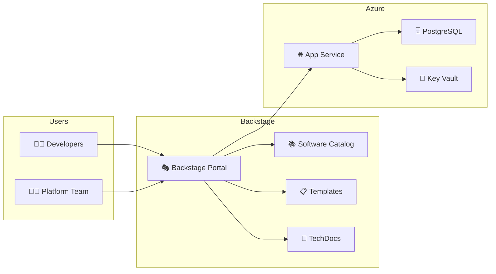

<!-- BADGES:START -->
[](https://github.com/POps-Rox/backstage-bootstrap/actions/workflows/ci.yml)
[](https://opensource.org/licenses/MIT)
[](https://github.com/POps-Rox/backstage-bootstrap/pulls)
[](https://github.com/POps-Rox/backstage-bootstrap/graphs/commit-activity)
[](https://backstage.io)
[](https://www.terraform.io)
<!-- BADGES:END -->

# 🚀 Backstage Bootstrap

> Infrastructure as Code and setup scripts to deploy a [Backstage](https://backstage.io) instance for your Platform Ops team.

Part of the [POps-Rox](https://github.com/POps-Rox) Platform Ops organization.

## 📖 Overview

This repository provides everything you need to deploy and configure a Backstage instance on Azure:



## 🏗️ Architecture



## 📂 Structure

```
backstage-bootstrap/
├── terraform/          # Azure infrastructure (App Service, PostgreSQL, Key Vault)
├── scripts/            # Setup and deployment scripts
├── docs/               # Deployment guides and runbooks
└── README.md
```

## 🚀 Quick Start

```bash
# 1. Clone
git clone https://github.com/POps-Rox/backstage-bootstrap.git
cd backstage-bootstrap

# 2. Configure
cp terraform/terraform.tfvars.example terraform/terraform.tfvars
# Edit terraform.tfvars with your values

# 3. Deploy infrastructure
cd terraform
terraform init
terraform plan
terraform apply

# 4. Deploy Backstage
./scripts/deploy.sh
```

## 🤝 Contributing

See [CONTRIBUTING.md](CONTRIBUTING.md) for guidelines.

## 📄 License

This project is licensed under the MIT License — see the [LICENSE](LICENSE) file for details.
